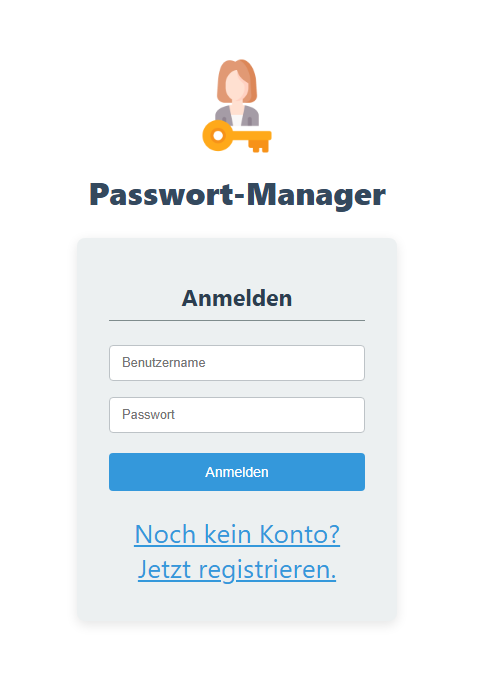
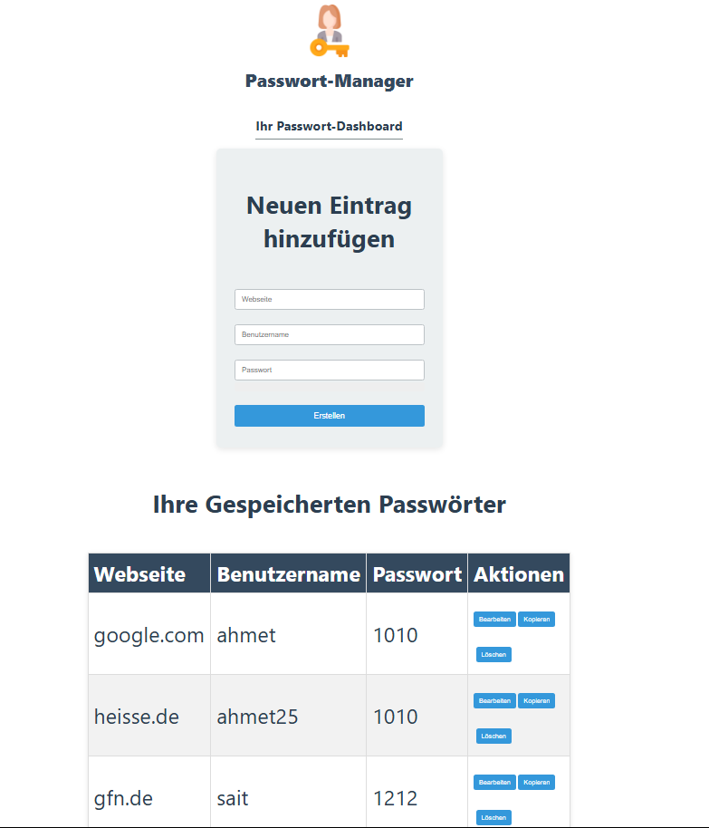

ENGLISCH:
Password Manager - Full-Stack Application
This is a secure full-stack password manager application developed as a final project for the "Fachinformatiker für Anwendungsentwicklung" (Application Development Specialist) training program. The application features a secure REST API protected by JSON Web Tokens (JWT) and an interactive user interface built with React.

✨ Features
Secure Authentication: User registration and login with password hashing (BCrypt) and JWT-based sessions.

Full CRUD Functionality: Create, Read, Update, and Delete (CRUD) operations for password entries.

User-Specific Data Access: Each user can only access their own securely stored passwords.

Modern Architecture: A robust Java/Spring Boot backend with a clean, layered architecture (Controller, Service, Repository).

Interactive Frontend: A dynamic Single-Page Application (SPA) built with React, providing a smooth user experience.

Additional UX-Features: Toast notifications for actions, a password strength meter, and a "copy password" function.

🛠️ Technology Stack
Area

Technology

Backend

Java 17, Spring Boot, Spring Security, Spring Data JPA

Frontend

React, JavaScript (ES6+), Axios, React-Hot-Toast

Database

MySQL

Build Tools

Maven (for Backend), npm (for Frontend)

🚀 API Endpoints
The backend API provides the following endpoints:

Method

URL

Description

Access

POST

/api/auth/register

Registers a new user.

Public

POST

/api/auth/login

Logs in a user and returns a JWT.

Public

GET

/api/passwords

Lists all passwords for the logged-in user.

Protected

POST

/api/passwords

Creates a new password entry.

Protected

PUT

/api/passwords/{id}

Updates an existing password entry.

Protected

DELETE

/api/passwords/{id}

Deletes a password entry.

Protected

⚙️ Setup and Installation
To run the project locally, please follow these steps:

Prerequisites
Java JDK 17 or higher

Node.js and npm

A running MySQL server

Backend Setup
Clone the repository.

Navigate to the backend directory: cd backend

Create a new MySQL database named password_manager_db.

Open the src/main/resources/application.properties file and update spring.datasource.username and spring.datasource.password with your MySQL credentials.

Run the application from your IDE or by using the command mvn spring-boot:run.

The backend will be running on http://localhost:8080 by default.

Frontend Setup
Open a new terminal and navigate to the frontend directory: cd frontend

Install the dependencies: npm install

Start the development server: npm start

The frontend will be running on http://localhost:3000 by default and will open in your browser.

DEUTSCH:
Passwort-Manager: Full-Stack-Anwendung
Dies ist eine sichere Full-Stack-Anwendung zur Passwortverwaltung, die als Abschlussprojekt für die Umschulung zum Fachinformatiker für Anwendungsentwicklung entwickelt wurde. Die Anwendung verfügt über eine sichere REST-API, die durch JSON Web Tokens (JWT) geschützt ist, und eine interaktive Benutzeroberfläche, die mit React erstellt wurde.

✨ Features
Sichere Authentifizierung: Benutzerregistrierung und -anmeldung mit passwort-hashing (BCrypt) und JWT-basierten Sitzungen.

Vollständige CRUD-Funktionalität: Erstellen, Lesen, Aktualisieren und Löschen (CRUD) von Passworteinträgen.

Benutzerspezifischer Datenzugriff: Jeder Benutzer kann nur auf seine eigenen, sicher gespeicherten Passwörter zugreifen.

Moderne Architektur: Ein robustes Java/Spring Boot-Backend mit einer klaren Schichtenarchitektur (Controller, Service, Repository).

Interaktives Frontend: Eine dynamische Single-Page-Application (SPA), die mit React erstellt wurde und eine reibungslose Benutzererfahrung bietet.

Zusätzliche UX-Features: Toast-Benachrichtigungen für Aktionen, eine Anzeige für die Passwortstärke und eine "Passwort kopieren"-Funktion.

🛠️ Technologie-Stack
Bereich

Technologie

Backend

Java 17, Spring Boot, Spring Security, Spring Data JPA

Frontend

React, JavaScript (ES6+), Axios, React-Hot-Toast

Datenbank

MySQL

Build-Tools

Maven (für Backend), npm (für Frontend)

🚀 API-Endpunkte
Die Backend-API stellt die folgenden Endpunkte zur Verfügung:

Methode

URL

Beschreibung

Zugriff

POST

/api/auth/register

Registriert einen neuen Benutzer.

Öffentlich

POST

/api/auth/login

Meldet einen Benutzer an und gibt ein JWT zurück.

Öffentlich

GET

/api/passwords

Listet alle Passwörter des eingeloggten Benutzers.

Geschützt

POST

/api/passwords

Erstellt einen neuen Passworteintrag.

Geschützt

PUT

/api/passwords/{id}

Aktualisiert einen bestehenden Passworteintrag.

Geschützt

DELETE

/api/passwords/{id}

Löscht einen Passworteintrag.

Geschützt

⚙️ Setup und Installation
Um das Projekt lokal auszuführen, folgen Sie bitte diesen Schritten:

Voraussetzungen
Java JDK 17 oder höher

Node.js und npm

Ein laufender MySQL-Server

Backend-Setup
Klonen Sie das Repository.

Navigieren Sie in den backend-Ordner: cd backend

Erstellen Sie eine neue MySQL-Datenbank mit dem Namen password_manager_db.

Öffnen Sie die Datei src/main/resources/application.properties und aktualisieren Sie spring.datasource.username und spring.datasource.password mit Ihren MySQL-Anmeldeinformationen.

Führen Sie die Anwendung über Ihre IDE oder mit dem Befehl mvn spring-boot:run aus.

Das Backend läuft standardmäßig auf http://localhost:8080.

Frontend-Setup
Öffnen Sie ein neues Terminal und navigieren Sie in den frontend-Ordner: cd frontend

Installieren Sie die Abhängigkeiten: npm install

Starten Sie den Entwicklungs-Server: npm start

Das Frontend läuft standardmäßig auf http://localhost:3000 und wird in Ihrem Browser geöffnet.