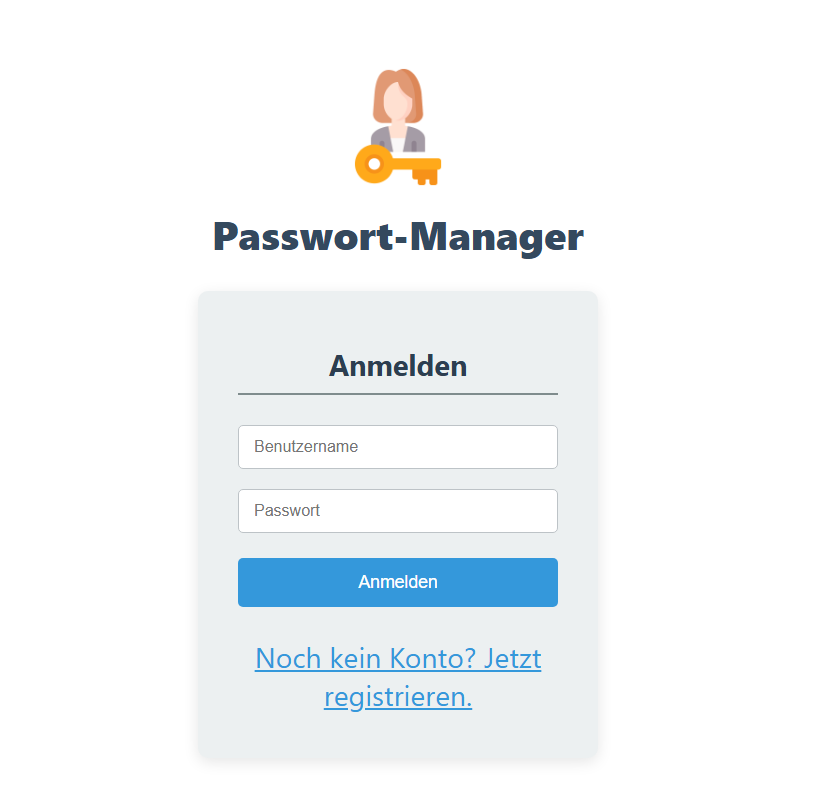
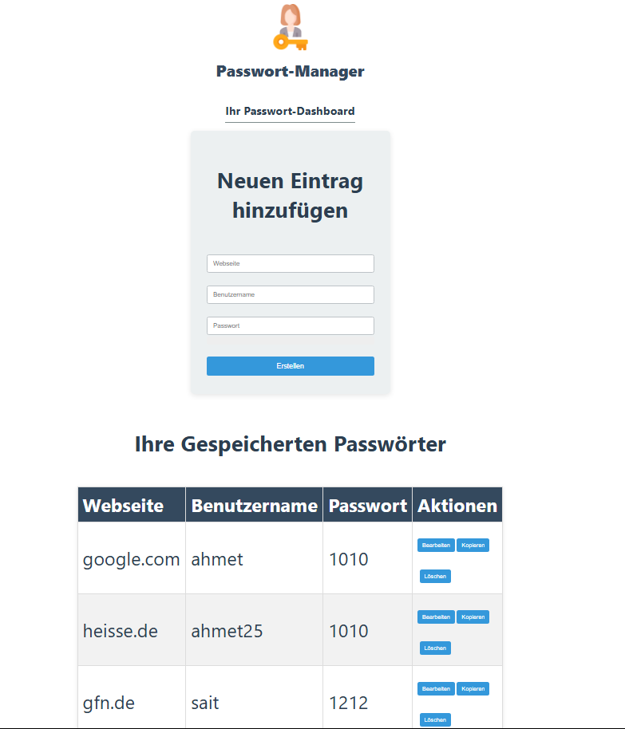

# Passwort-Manager API

Bei diesem Projekt handelt es sich um eine Passwort-Manager-Backend-Anwendung mit einer sicheren REST-API auf JWT-Basis, die im Rahmen der Ausbildung "Fachinformatiker für Anwendungsentwicklung" entwickelt wurde.

## ✨ Merkmale

- Sichere Benutzerregistrierung und Anmeldung (mit JWT)
- Vollständige CRUD-Operationen (Erstellen, Lesen, Aktualisieren, Löschen) für Passwortdatensätze
- Benutzerspezifischer Datenzugriff (Jeder Benutzer sieht nur seine eigenen Passwörter)
- Moderne und mehrschichtige Architektur (Controller, Service, Repository)

## 🛠️ Technologie-Stack

- Backend:** Java 17, Spring Boot 3
- Datenbank:** MySQL
- Sicherheit:** Spring Security, JSON Web Tokens (JWT)
- **Datenzugriff:** Spring Data JPA / Hibernate
- **Build Tool:** Maven

## 🚀 API Endpoints

| Methode  | URL                   | Beschreibung                                               | Zugriff   |
|----------|-----------------------|------------------------------------------------------------|-----------|
| `POST`   | `/api/auth/register`  | Registriert einen neuen Benutzer.                          | Public    |
| `POST`   | `/api/auth/login`     | Meldet den Benutzer an und liefert JWT.                    | Public    |
| `GET`    | `/api/passwords`      | Listet die Passwörter des angemeldeten Benutzers auf.      | Geschützt |
| `POST`   | `/api/passwords`      | Erstellt einen neuen Passwortdatensatz.                    | Geschützt |
| `PUT`    | `/api/passwords/{id}` | Aktualisiert den Passwortdatensatz mit der angegebenen ID. |           |
| `DELETE` | `/api/passwords/{id}` | Löscht den Passwort-Datensatz mit der angegebenen ID.      | Geschützt |

## ⚙️ Wie wird ausgeführt?

1. klonen Sie das Projekt.
2. erstellen Sie eine Datenbank mit dem Namen `password_manager_db` auf Ihrem lokalen MySQL-Server.
3. aktualisieren Sie den Datenbank-Benutzernamen und das Passwort in `src/main/resources/application.properties` auf Ihren eigenen.
4. starten Sie die Anwendung von Ihrer IDE oder mit dem `mvn spring-boot:run` Befehl.

## Fotos
,

Projekt-Architektur: Eine technische Reise durch den Passwort-Manager
Nachdem wir das "Was" unseres Projekts verstanden haben, schauen wir uns nun das "Wie" an. Wie genau funktionieren die einzelnen Teile im Maschinenraum unserer Anwendung?

Stellen wir uns unsere Anwendung wie ein modernes Restaurant vor. Es gibt eine Küche (das Backend), in der alles zubereitet wird, und einen Gastraum (das Frontend), in dem die Gäste sitzen und bestellen.

Teil 1: Die Küche (Das Backend - Unser Spring Boot Projekt)
Hier wird die eigentliche Arbeit geleistet. Die Küche ist hochorganisiert und jeder hat seine spezielle Aufgabe.

pom.xml (Die Einkaufsliste):

Was es ist: Dies ist die Einkaufsliste für unsere Küche. Hier steht genau, welche Zutaten und Werkzeuge (wie Spring Boot, 
MySQL-Treiber, Sicherheits-Tools) wir für unser Projekt benötigen. Maven ist der Einkäufer, der losgeht und alles besorgt.

application.properties (Die Küchenregeln):

Was es ist: Dies ist das große Whiteboard in der Küche. Hier stehen die wichtigsten Regeln: 
An welcher Adresse befindet sich der Vorratsraum (die Datenbank)? 
Was ist das Passwort für den Vorratsraum? Wie lange sind unsere "Gästepässe" (JWTs) gültig?

User.java & PasswordEntry.java (Die Rezeptvorlagen / Entities):

Was es ist: Das sind unsere leeren Bestellzettel oder Rezeptkarten. Sie definieren,
welche Informationen wir für einen Benutzer oder einen Passworteintrag benötigen (z.B. Name, Passwort, Webseite). 
JPA (Java Persistence API) ist derjenige, der diese Zettel liest und daraus die passenden Fächer im Aktenschrank (Datenbanktabellen) erstellt.

UserRepository.java & PasswordEntryRepository.java (Der Lagerist):

Was es ist: Dies ist der Lagerist, der direkten Zugang zum Vorratsraum (Datenbank) hat. 
Wenn wir ihm sagen "Finde den Benutzer mit dem Namen 'Sait'", dann geht er los und holt genau diesen Datensatz. 
Wir müssen ihm nicht erklären, wie er suchen soll; er weiß es einfach. Spring Data JPA gibt uns diesen sehr fähigen Lageristen.

UserService.java & CustomUserDetailsService.java (Der Chefkoch):

Was es ist: Der Chefkoch ist für die eigentliche Zubereitung zuständig. Er nimmt die rohen Zutaten (z.B. ein einfaches Passwort) 
und verarbeitet sie nach einem speziellen Rezept (z.B. hashen mit BCrypt). Der CustomUserDetailsService ist ein spezialisierter Koch, 
der nur dafür da ist, dem Sicherheitspersonal einen bestimmten Benutzer zu bringen, wenn danach gefragt wird.

UserController.java & PasswordEntryController.java (Der Kellner):

Was es ist: Der Kellner ist die einzige Verbindung zwischen der Küche und dem Gastraum. 
Er nimmt die Bestellungen vom Frontend entgegen (z.B. "Ein neuer Benutzer möchte sich registrieren" oder 
"Zeige mir alle Passwörter"). Er gibt die Bestellung an den Chefkoch (Service) weiter und bringt das fertige Gericht (die Daten) zurück zum Gast.

SecurityConfig.java (Der Sicherheitschef):

Was es ist: Dies ist der Sicherheitschef des Restaurants. Er legt die Regeln fest:
Wer darf überhaupt ins Restaurant? (z.B. /api/auth/login ist die Eingangstür, die für alle offen ist).
Welche Bereiche sind nur für Gäste mit einem gültigen Armband (JWT) zugänglich? (Alle anderen Bereiche).

JwtUtil.java (Die Armband-Maschine):

Was es ist: Eine spezielle Maschine, die nach erfolgreicher Identitätsprüfung (Login) 
die fälschungssicheren Festival-Armbänder (JWTs) druckt. Sie weiß, wie lange ein Armband gültig ist und versieht es mit einer geheimen Signatur.

JwtAuthenticationFilter.java (Der Türsteher):

Was es ist: Der Türsteher, der an jeder Tür zu den geschützten Bereichen steht. Jedes Mal, 
wenn ein Gast (eine Anfrage) kommt, kontrolliert er das Armband (JWT). Er prüft, ob es echt und noch gültig ist. 
Nur wenn alles stimmt, lässt er den Gast passieren.

Teil 2: Der Gastraum (Das Frontend - Unser React Projekt)
Hier interagiert der Gast (Benutzer) mit unserer Anwendung.

package.json (Die Möbel- und Dekorationsliste):

Was es ist: Ähnlich wie die pom.xml in der Küche, ist dies die Liste aller Möbel, 
Dekorationen und Werkzeuge (z.B. React, axios, react-hot-toast), die wir für unseren Gastraum benötigen. npm ist der Lieferdienst, der alles bringt und aufbaut.

App.js (Der Restaurant-Manager):

Was es ist: Der Manager des Gastraums. Er entscheidet, was der Gast sieht. 
Sieht der Gast den Eingangsbereich mit der Wahl zwischen "Anmelden" und "Registrieren"? 
Oder ist der Gast bereits eingeloggt und sitzt an seinem Tisch (Dashboard)? Der Manager behält den Überblick.

Dashboard.js (Der Tisch des Gastes):

Was es ist: Dies ist der persönliche Tisch des Gastes, nachdem er sich angemeldet hat. 
Hier kann er seine bereits bestellten Gerichte (Passwörter) sehen, neue Gerichte bestellen (neue Einträge hinzufügen) oder Bestellungen ändern/stornieren.

PasswordStrengthMeter.js (Der "Scharf"-Anzeiger):

Was es ist: Eine kleine, hilfreiche Anzeige, die dem Gast beim Bestellen (Passwort erstellen) anzeigt, wie "scharf" oder "sicher" seine Wahl ist.

axios (Das Telefon zur Küche):

Was es ist: Das moderne Telefonsystem, das der Gastraum verwendet, um Bestellungen schnell und effizient an die Küche (Backend-API) durchzugeben.

react-hot-toast (Die Service-Glocke):

Was es ist: Die kleine, elegante Glocke auf dem Tisch. Wenn eine Bestellung erfolgreich war, 
klingelt sie mit einer positiven Nachricht ("Eintrag erstellt!"). Wenn etwas schiefgegangen ist, gibt sie eine diskrete Fehlermeldung aus.